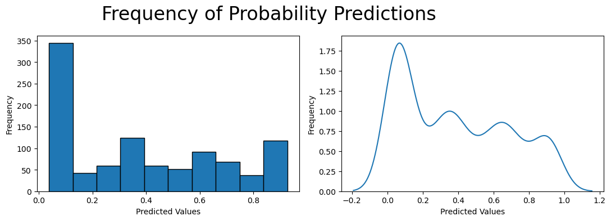
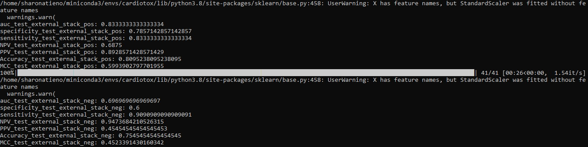

# Prediction of hERG Channel Blockage

> This project aims to use Ersilia's cardiotoxnet-herg(eos2ta5) model to predict the probability of chemical compounds   toxicity to the hERG gene. The hERG gene is crucial to heart action, small molecules blocking the gene could lead to potential heart dsyfunction, due to this, the hERG gene is a big concern for pharmaceutical companies and has lead to drugs that cause hERG-related cardiotoxicity being withdrawn from the market.

             

## Table Of Contents
- [Prediction of hERG Channel Blockage](#Prediction-of-hERG-Channel-Blockage)
  - [Table Of Contents](#table-of-contents)
    - [Objective](#objective)
    - [Data](#data)
    - [Installation](#installation)
    - [Test Usage](#usage)
    - [Project Task 1](#task1)
    - [Project Task 2](#task2)
    - [Findings](#findings)
    - [License](#license)
    - [Acknowledgements](#acknowledgements)
      - [Technologies Used](#technologies-used)

### Objective
> * To predict the probability of toxicity in the chemical compounds of drugs

### [Data](#data)
> The dataset used for this project can be found in the data folder. The dataset contains 1000 entries of SMILES
> The dataset is called `reference_library.csv`

### [Installation](#installation)
The project was tested on Ubuntu 22.04.3 with Python 3.7.12
> To Reproduce the project, follow these steps:

> From your Ubuntu Terminal

1. Install miniconda 

`mkdir -p ~/miniconda3` 

`wget https://repo.anaconda.com/miniconda/Miniconda3-latest-Linux-x86_64.sh -O ~/miniconda3/miniconda.sh` 

`bash ~/miniconda3/miniconda.sh -b -u -p ~/miniconda3` 

`rm -rf ~/miniconda3/miniconda.sh`

`~/miniconda3/bin/conda init bash`

2. Install Git and Github CLI 

Install Git through [here](https://git-scm.com/book/en/v2/Getting-Started-Installing-Git)

Installing Github CLI 

Use conda to install Github CLI

`conda install gh -c conda-forge`

`gh auth login`

3. Install Git LFS 

`conda install git-lfs -c conda-forge`

`git-lfs install`

4. Create conda environment ( `conda create -n ersilia python=3.7` )

5. Activate conda environment ( `conda activate ersilia` )

6. Install ersilia ( `pip install ersilia`)

This project was run on Visual Studio Code, if you are using WSL Ubuntu you just have to install Visual Studio Code on your Windows operating system, then right on your Ubuntu terminal where you have activated conda ersilia environment run the command `code .` This should open visual studio code. Proceed to install Jupyer Notebook and Python Extension


### [Test Usage](#usage)

Create an ipynb file to test models from the Ersilia Model Hub ```index.ipynb```

Single SMILE string

 ```from ersilia import ErsiliaModel```

 ```smile = "CC(=O)SC1CC2=CC(=O)CCC2(C)C2CCC3C(CCC34CCC(=O)O4)C12"```

 ```model = ErsiliaModel("eos3b5e") # pick preferred model```

 ```model.serve()```

 ```model.run(smile)```

 Multiple SMILES string

 ```from ersilia import ErsiliaModel```

 ```smiles = ["CC(=O)SC1CC2=CC(=O)CCC2(C)C2CCC3C(CCC34CCC(=O)O4)C12","CCCCCCCCCC[N+](CC)(CC)CC"]```

 ```model = ErsiliaModel("eos3b5e") # pick preferred model```

 ```model.serve()```

 ```model.run(smiles)```

### [Project Task 1](#task1)

* Run predictions of 1000 molecules and evaluate results

* Make sure the molecules are presented in the standard SMILES format

* You can get molecules from public databases such as [PubChem](https://pubchem.ncbi.nlm.nih.gov/), [ChEMBL](https://www.ebi.ac.uk/chembl/), [DrugBank](https://go.drugbank.com/) and [ZINC](https://zinc20.docking.org/)

* Clone the repository ```git clone https://github.com/atienosonia/ersilia_machine_learning.git```

* Install RDKit package from your Ubuntu terminal to allow you perform molecular validation and standardization ```pip install rdkit```

* Open Visual Studio Code through your Ubuntu terminal `code .`

* Select ersilia kernel

* Run the notebook 00_model_bias.ipynb

### [Findings](#findings)

* 1000 SMILES were used for the project, after molecular validation and standardization only 995 SMILES remained.Out of the 995 , 636 were hERG non blockers and 359 were hERG blockers

* The histogram and KDE plot show the distribution of probability of toxicity predictions with most observations being less than 0.5, this highlights the class imbalance of the dataset. Most of the predictions were non blockers



### [Project Task 2](#task2)
* Identify a result that can be produced from the authors publication, after producing the result check if they are the same as the result the authors obtained in their publication

* The author's publication can be found [here](https://drive.google.com/file/d/18ul4T1nYLA8z1bHCVe4nK-IcNpIx58nv/view?usp=sharing), the model whose results we are trying to reproduce is known as cardiotox net

* The datasets that were used to train the model can be found [here](https://github.com/Abdulk084/CardioTox/tree/master/data)

* Three test sets were used to train the model, train set 1 had a total of 12,620 molecules with 6643 labelled as hERG blockers and 5977 as hERG non-blockers. train set 2 had 11 blockers and 30 non-blockers and train set 3 had 53 blockers and 786 non-blockers

* The model was tested on Ubuntu 20.04 Python 3.8.5

* To run the cardiotox net model follow the following steps :

1. install miniconda 

2. download environment.yml file from [here](https://github.com/Abdulk084/CardioTox/blob/master/environment.yml)

3. restore environment.yml

```conda env create -f environment.yml```

4. activate the environment

```conda activate cardiotox```

5. install pyBioMed

```cd PyBioMed```

```python setup.py install```

```cd ..```

6. test the model

```python test.py```

You should get the below output :



You might encounter the error ```ModuleNotFoundError: No module named 'numpy.random.bit_generator'``` while running ```python test.py```, you can solve this by running the following codes in your command line interface

```pip install protobuf==3.20.0```

```pip install numpy==1.19.5```

now you should be able to run ```python test.py``` without generating any error.

To generate the results the authors got (i.e NPV, SPE, SEN etc) you will need to have the the predicted values. To do that you need to run the cardiotox model and store the predictions. You can get cardiotox model implementation [here](https://github.com/atienosonia/ersilia_machine_learning/blob/master/cardiotex_implementation.py), download the file and store it in your Cardiotox Folder, right after running ```python test.py```. go ahead and run ```python cardiotex_implementation.py```, this should store the predictions in your data folder, after which you can now proceed to producing the publication results. 

#### Results

The evaluation metrics used for the model were AUC-ROC, specifity(SPE), sensitivity(SEN), negative predictive
value (NPV), positive predictive value (PPV), accuracy (ACC) and Matthew’s correlation coefcient (MCC). **AUC-ROC** evaluates the models ability to distinguish hERG blockers and hERG non - blockers, **specifity (SPE)** describes what
proportion of the non-hERG blocker class got correctly classifed, **NPV** describes the probability of a molecule predicted as non-hERG blocker to be actually as non-hERG blocker, **PPV** describes the probability of a molecule predicted as hERG blocker to be actually as hERG blocker, **ACC** measures the predictions the model got right and MCC is is a single-value metric that has a range of −1 to 1 where −1 indicates a completely wrong binary classifer while 1 indicates a completely correct binary classifer. Below are the evaluation metrics

| Data      | Method   | MCC   | NPV  |  ACC |  PPV |  SPE | SEN  | B-ACC |
| ----------| ---------|-------|------|------|------|------|------|-------|
| Test Set 1| Cardiotox| 0.5994|0.6875|0.8095|0.8929|0.7857|0.8333|0.8095 |
| Test Set 2| Carditox | 0.4523|0.9474|0.7545|0.4545|0.6   |0.9091|0.7545 |
| Test Set 3| Cardiotox| 0.2202|0.986 |0.7462|0.1125|0.6983|0.7941|0.7462 |

You can go ahead and compare the results with the authors. 

From Ersilia Model Hub run eos2ta5 on test set 1 . Generate the predictions and compute the evaluation metrics 

| Data      | Method   | MCC   | NPV  |  ACC |  PPV |  SPE | SEN  | B-ACC |
| ----------| ---------|-------|------|------|------|------|------|-------|
| Test Set 1| eos2ta5  | 0.5994|0.6875|0.8095|0.8929|0.7857|0.8333|0.8095 |

Based on the results obtained, the model Cardiotox Net evaluation metrics are reproducible. eos2ta5 results are also consistent with cardiotox net results.

### [License](#license)

> This project is licensed under the GNU General Public License - see the [LICENSE](LICENSE.md) file for details

### [Technologies Used](#technologies-used) 

- [ersilia](https://www.ersilia.io/) for creating the models.
- [RDKit](https://www.rdkit.org/) for preparation of chemical data.
- [Pandas](https://pandas.pydata.org/) for data manipulation.
- [Matplotlib](https://matplotlib.org/) for visulizations.


